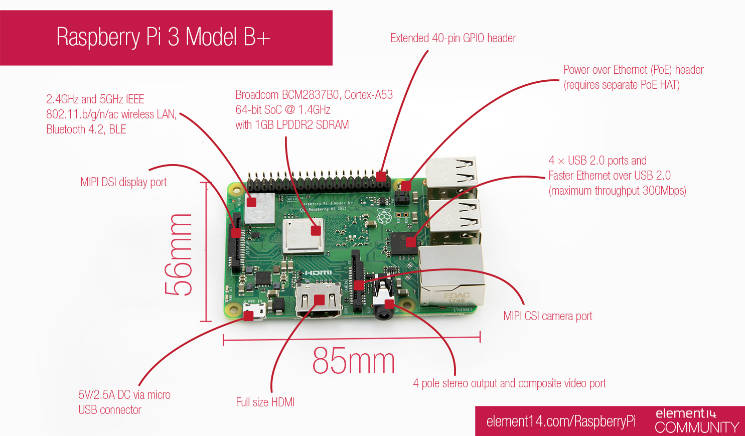

author: Shibao,Tetsuya
summary: RaspberryPi
id: 00-Install-AWS-CLI-to-RPI
categories: codelab,markdown
environments: Web
status: Published
feedback link: https://github.com/midnight480/handson-manual
analytics account: xxxxxx

# How to Install AWS CLI to Raspberry Pi

## Enviorment
Duration: 0:00:30

### Machine

<button>
  [SWITCHSCIENCE - Raspberry Pi 3 Model B+](https://www.switch-science.com/catalog/3850/)
</button>



### OS

* Raspberry Pi OS

```console
> cat /etc/os-release
PRETTY_NAME="Raspbian GNU/Linux 9 (stretch)"
NAME="Raspbian GNU/Linux"
VERSION_ID="9"
VERSION="9 (stretch)"
ID=raspbian
ID_LIKE=debian
HOME_URL="http://www.raspbian.org/"
SUPPORT_URL="http://www.raspbian.org/RaspbianForums"
BUG_REPORT_URL="http://www.raspbian.org/RaspbianBugs"
> uname -a
Linux raspberrypi 4.14.79-v7+ #1159 SMP Sun Nov 4 17:50:20 GMT 2018 armv7l GNU/Linux
```

## Install AWS CLI
Duration: 0:03:00

```console
> sudo apt-get update -y
...
パッケージリストを読み込んでいます... 完了
> sudo apt-get install -y awscli
...
python3-rsa (3.4.2-1) を設定しています ...
python3-jmespath (0.9.0-2) を設定しています ...
python3-dateutil (2.5.3-2) を設定しています ...
python3-botocore (1.4.70-1) を設定しています ...
python3-s3transfer (0.1.9-1) を設定しています ...
awscli (1.11.13-1) を設定しています ...
> aws --version
aws-cli/1.11.13 Python/3.5.3 Linux/4.14.79-v7+ botocore/1.4.70
```

Positive
: `sudo apt-get update -y`は必ず実施してください

Negative
: Raspberry Piにインストール可能なAWS CLIは最新版でもv1.x系となります

<button>
  [AWS コマンドラインインターフェイス](https://aws.amazon.com/jp/cli/)
</button>

## AWS Settings
Duration: 0:03:00

```console
> aws configure              
AWS Access Key ID [None]: AKXXXXX
AWS Secret Access Key [None]: YYYYY
Default region name [None]: ap-northeast-1
Default output format [None]: json
>
> ls -la ~/.aws
...
-rw-------  1 pi pi   48  M月 DD HH:MI config
-rw-------  1 pi pi   48  M月 DD HH:MI credential
```

Positive
: Shell Script内で実行するAWS CLIで実行する際の権限を設定します

Negative
: Access Key, Secret Access Keyは管理者から払い出されたものを設定してください。

## Create Shell Script
Duration: 0:03:00

```console
> vi ZZZZ.sh
> crontab -e
# 10分おきに実行
*/10 * * * * ZZZZ.sh
```

Positive
: vimの場合、 `:wq` で保存することになります

### ShellScript

* AWS Kinesis Data FirehoseにCSVファイルを送るための定義となります
  * CSVから項目を抽出してJSON形式にしてデータをロードさせる形となります
  * もし初期のCSVから出力するデータ形式がJSONの場合は、awkコマンドで切り出している箇所は不要です

```console
#!/bin/bash
 
# Kinensis Firehoseのストリーム名を設定
streamname=${kinesisn-data-firehose-stream-nama}
 
while [ 1 ]
do
    (
        time=`date '+%F %T'`
        col1=$(awk -F= '')
        col2=$(awk -F= '')
        col3=$(awk -F= '') 
        payload='{\"time\":\"'$time'\", \"col1\":'$col1', \"col2\":'$col2', \"col3\":'$col3'}'
        echo $payload
        aws firehose put-record --delivery-stream-name $streamname --record="{\"Data\":\"$payload\n\"}"
    ) &
    sleep 15
done
```

* 参考
  * [DS18B20センサー+Raspberry Piで取得した温度をAmazon Kinesis FirehoseからS3へ格納](https://www.yamamanx.com/ds18b20_raspberry-pi_amazon-kinesis-firehose_s3_athena-quicksight/)

## Complete
Duration: 0:00:10

* 設定作業お疲れさまでした

Positive
: AWS CLIはGUIと比較して、作業者のスキルに依存せず再現性の高い作業も可能となります

Negative
: AWS CLI v2になると入力可能なコマンドの幅が増えるためRaspberry Piで利用可能になったら変更を推奨します