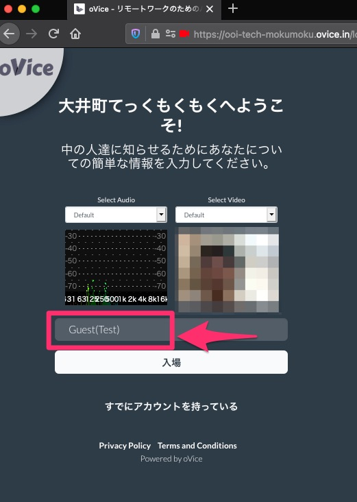
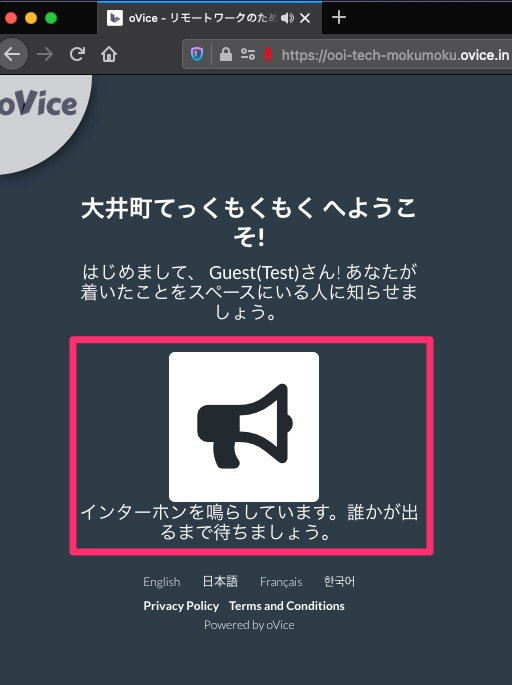

author: Shibao,Tetsuya
summary: Desc
id: 01-use-manual-oVice
categories: codelab,markdown
environments: Web
status: Published
feedback link: https://github.com/midnight480/handson-manual
analytics account: 196534296

# oViceを使ってみよう

## はじめに
Duration: 0:05:00

### oViceとは

Negative
: このページは紹介しているのみなのでアカウント登録は実施しないでください！

* 機能概要 - オンラインコミュニケーションスペース
  * 2次元アイコンで特定のルーム、会議室内を行き来する
  * 音声・テキストチャット
  * 画面共有

* サイトURL
  * https://ovice.in/ja/
  * [本社所在地](https://ovice.in/ja/about-us/) - 石川県七尾市元府中町エ113B
  * [料金体系](https://ovice.in/ja/pricing/)

* 現在はトライアル期間中
  * [テレワークやイベントで使えるバーチャル空間を無償提供(5/31まで)](https://prtimes.jp/main/html/rd/p/000000034.000058507.html)
  
* 適用される法律
  * [利用規約](https://www.notion.so/oVice-2021-5-19-e93174118cd04934aca03c4ea4c409c4)
    > 本規約は、日本国法に準拠し、解釈されるものとします。

### 実績

* [JAWS DAYS 2021](https://jawsdays2021.jaws-ug.jp/)
  * [oViceコミュニケーションスペースの使い方](https://jawsdays2021.jaws-ug.jp/ovice-tutorial/)
  * [JAWS DAYS 2021 対談 : oVice が実現するオンラインイベントの双方向体験とは ?](https://aws.amazon.com/jp/builders-flash/202103/jaws-days-conversation/?awsf.filter-name=*all)
  
* [外務省 - 帰国留学生総会](https://www.mofa.go.jp/mofaj/p_pd/ep/page6_000536.html)
  * [外務省とJAPI共催、世界40か国以上の帰国留学生が集まるオンライン国際カンファレンスでoViceが活用されました。](https://ovice.in/ja/%e5%a4%96%e5%8b%99%e7%9c%81%e3%81%a8japi%e5%85%b1%e5%82%ac%e3%80%81%e4%b8%96%e7%95%8c40%e3%81%8b%e5%9b%bd%e4%bb%a5%e4%b8%8a%e3%81%ae%e5%b8%b0%e5%9b%bd%e7%95%99%e5%ad%a6%e7%94%9f%e3%81%8c%e9%9b%86/)

## 使い方の動画
Duration: 0:10:00

### 使い方紹介動画

* oVice公式

<button>
  [YouTube](http://www.youtube.com/watch?v=C8r02gYDA50)
</button>

<button>
  [トラブルシューティング](https://ovice.zendesk.com/hc/ja/categories/900000303506-%E3%83%88%E3%83%A9%E3%83%96%E3%83%AB%E3%82%B7%E3%83%A5%E3%83%BC%E3%83%86%E3%82%A3%E3%83%B3%E3%82%B0)
</button>

* JAWS DAYS 2021

<button>
  [YouTube](http://www.youtube.com/watch?v=q0UUgAkiNRk)
</button>

## 実際につかってみよう
Duration: 0:10:00

### ログインURL

* 以下のボタンからリンク先に移動します

<button>
  [トライアル中のoVice](https://ooi-tech-mokumoku.ovice.in/)
</button>

Positive
: このあとログイン名を入力いただきますが、このスペースのみ有効なため、アカウント作成されるわけではないです

Negative
: 以降の画面はmacOS BigSur 11.3.1, Mozilla Firefox 88.0.1 (64 ビット)で取得した画面となりますが、各自の操作へ影響はないと思います。

### 拡張機能の有効

* マイク
  

* カメラ
  
  
* 有効化の確認
  

* ログイン名の入力
  

### プライベートスペースへの入室
  
* 呼び出し前
  
  
* 呼び出し前
  
  
* 入室後
  
  
* 機能
  

Positive
: このあとは実際に入室してから動かしながら説明します

## （おまけ）管理者のオペレーション

### 入室待ちの通知

* 呼び出し中
  

* 入室対応
  

Positive
: 基本的にはパブリックスペースに案内するとよいです