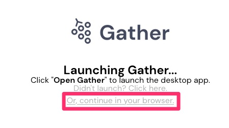
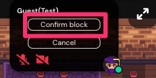

author: Shibao,Tetsuya
summary: Desc
id: 02-use-manual-gather
categories: codelab,markdown
environments: Web
status: Published
feedback link: https://github.com/midnight480/handson-manual
analytics account: 196534296

# Gatherを使ってみよう

## はじめに
Duration: 0:05:00

### Gatherとは

Negative
: このページは紹介しているのみなのでアカウント登録は実施しないでください！

* 機能概要 - オンラインコミュニケーションスペース
  * 2次元をアバターを移動させる
  * 音声・テキストチャット
  * 画面共有
  * カスタムマップ
  * カスタムオブジェクト（環境音,Google Meet/ZoomなどのURL）

* サイトURL
  * [公式](https://gather.town/)
  * [本社所在地](https://pitchbook.com/profiles/company/454511-26#overview)  
    547 Elm Avenue, San Bruno, CA, United States
  * [料金体系](https://gather.town/pricing)  
  ※ Free Tier Accommodates 25 Online Users!

* 通信仕様
  * [ネットワークについて](https://support.gather.town/help/data-protection-and-encryption#data-encryption)  
  一般的なWebRTCを用いtら E2E(P2P)でのTCP/443によるHTTPS通信

* 適用される法律
  * [利用規約](https://gather.town/terms-of-use)  
    > United States Legal Compliance  
    ※ EUはGDPR、USのCalifornia州は独自の個人情報取得に関する法律が適用される

### 実績

* [高エネルギー加速器研究機構 - 研究会「放射線検出器とその応用」](https://www-conf.kek.jp/rdetconf/index.html)
  * [ポスター会場](https://www-conf.kek.jp/rdetconf/GatherTown.pdf)

* [株式会社アニマ](https://www.studioanima.co.jp/company/)
  * [2021.01.21 - バーチャルオフィスサービスの導入について](https://www.studioanima.co.jp/Anigon-chat/2021/01/21/post-5326/)

* [放課後モノづくり倶楽部](https://monodukuri.club/)
  * [チームでオフィスを持ちました！(Gatherにね)](https://note.com/hiroki_hachisuka/n/neeada2121807)

* [クラスメソッド株式会社](https://classmethod.jp/company/overview/)
  * [レトロRPG風デザインのオンラインビデオ通話スペース『 Gather.Town 』で”出社して仕事＆気軽に雑談”を楽しく仮想体験！](https://dev.classmethod.jp/articles/gather-town-as-a-virtual-office/)
  * [Gather.Town 有料プランの費用感について](https://dev.classmethod.jp/articles/gather-town-pricing/)
  * [Gather.Town でビデオ会議サービス(Zoom, Google Meet等)との連携を行う](https://dev.classmethod.jp/articles/gather-town-integration-with-external-call-and-zoom-call/)

## 使い方の動画
Duration: 0:10:00

### 使い方紹介動画

* Gather公式

<button>
  [YouTube - Intro to Gather](https://www.youtube.com/watch?v=89at5EvCEvk)
</button>

* 【ダナン在住エンジニア】KZY

<button>
  [YouTube - 【Gather Town】How to start Gather Town, which is the RPG like virtual office!](https://www.youtube.com/watch?v=G2tBlLADZ2A)
</button>

## 実際につかってみよう
Duration: 0:10:00

### ログインURL

* 主催者から通知されるURLを利用してください

<button>
  [個人で運用しているGather Space](https://gather.town/i/y9A0i4WU)
</button>

Positive
: このあとログイン名を入力いただきますが、このスペースのみ有効なため、アカウント作成されるわけではないです

Negative
: 以降の画面はmacOS BigSur 11.3.1, Mozilla Firefox 88.0.1 (64 ビット)で取得した画面となりますが、各自の操作へ影響はないと思います。

### プライベートルームのパスワード

* 主催者から通知されるパスワードを入力

### 拡張機能の有効

* アプリケーションとの関連付けはキャンセル

* ブラウザで続ける

* マイクとカメラの設定

* （任意）名前とアバターの設定

### （任意）チュートリアルのスキップ

* 接続後に表示されるチュートリアルはスキップ可能

## 簡単な機能説明
Duration: 0:05:00

### 入室後の画面

### チャット

### アクション

### （おまけ）管理者から強制退出

Positive
: このあとは実際に入室してから動かしながら説明します