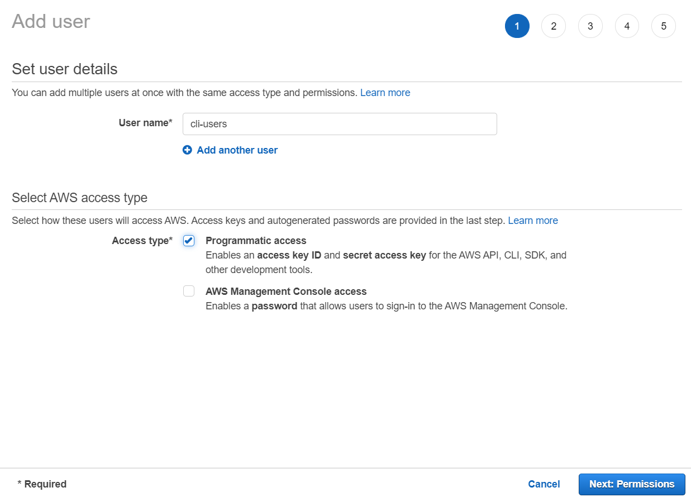
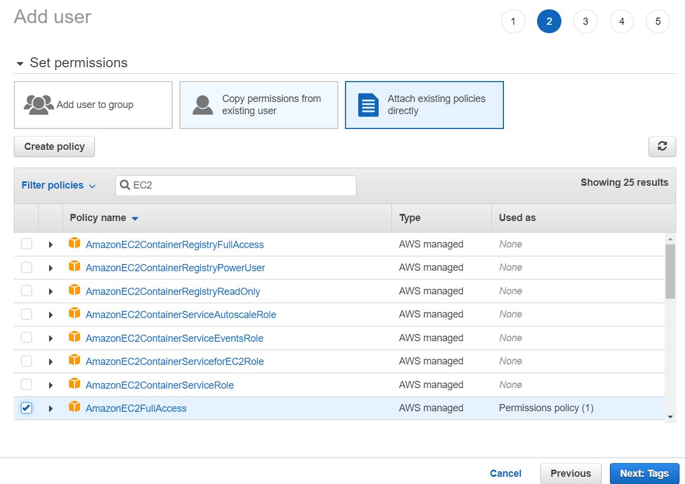
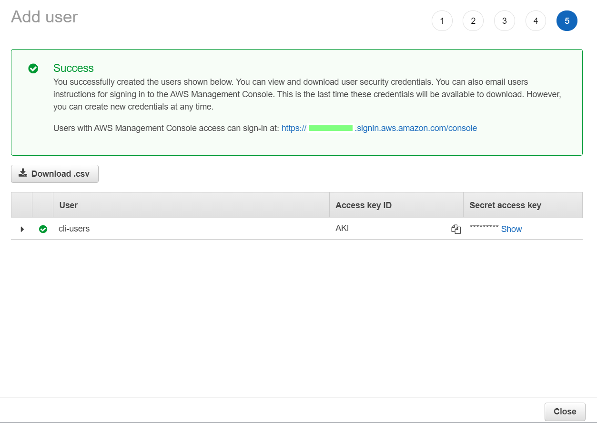

author: Shibao,Tetsuya
summary: Create AMI by AWS CLI
id: 03-AWS-CLI-CreateAMI
categories: codelab,markdown
environments: Web
status: Published
feedback link: https://github.com/midnight480/handson-manual
analytics account: 196534296

# AWS CLIを使ってEC2からAMIを作成する

## 事前準備
Duration: 0:10:00

### IAM Policy

「[最小限の特権を認める](https://docs.aws.amazon.com/ja_jp/IAM/latest/UserGuide/best-practices.html#grant-least-privilege)」とあるように、  
本来は必要最低限のポリシーで運用を行うべきですが、  
今回はオペレーションの都合上、権限が幅広いものを提示しています。

```
arn:aws:iam::aws:policy/AdministratorAccess
arn:aws:iam::aws:policy/AmazonEC2FullAccess
```

### IAM User

前述のIAM Policyをアタッチする形でアクセスキーを発行する。

[AWS アクセスキーを作成するには、どうすればよいですか?](https://aws.amazon.com/jp/premiumsupport/knowledge-center/create-access-key/)







### AWS CLI

未インストールの場合は、以下より取得してください。

<button>
  [AWS コマンドラインインターフェイス](https://aws.amazon.com/jp/cli/)
</button>

## AWS CLIの設定と確認
Duration: 0:10:00

```
> $PSVersionTable
Name                           Value
----                           -----
PSVersion                      5.1.19041.1023
PSEdition                      Desktop
PSCompatibleVersions           {1.0, 2.0, 3.0, 4.0...}
BuildVersion                   10.0.19041.1023
CLRVersion                     4.0.30319.42000
WSManStackVersion              3.0
PSRemotingProtocolVersion      2.3
SerializationVersion           1.1.0.1
>
> aws --version
aws-cli/2.2.5 Python/3.8.8 Windows/10 exe/AMD64 prompt/off
> 
```

Negative
: アクセスキー、シークレットアクセスキーは管理を徹底すること  

```
> aws configure --profile cli-users
AWS Access Key ID [None]: AKI********
AWS Secret Access Key [None]: ********
Default region name [None]: ap-northeast-1
Default output format [None]: json
>
```

Positive
: AWS CLIで実行するときは必ず実行すること  

```
> aws sts get-caller-identity --profile cli-users
{
    "UserId": "AID******",
    "Account": "9999999999",
    "Arn": "arn:aws:iam::9999999999:user/cli-users"
}

> 
```

## AWS CLIs
Duration: 0:30:00

### Documents

* [aws ec2](https://docs.aws.amazon.com/cli/latest/reference/ec2/)のサブコマンド
  * [describe-images](https://docs.aws.amazon.com/cli/latest/reference/ec2/describe-images.html)
  * [describe-instances](https://docs.aws.amazon.com/cli/latest/reference/ec2/describe-instances.html) 
  * [describe-snapshots]([https://docs.aws.amazon.com/cli/latest/reference/ec2/describe-snapshots.html)
  * [describe-tags](https://docs.aws.amazon.com/cli/latest/reference/ec2/describe-tags.html)
  * [create-images](https://docs.aws.amazon.com/cli/latest/reference/ec2/create-image.html)
  * [create-snapshot](https://docs.aws.amazon.com/cli/latest/reference/ec2/create-snapshot.html)
  * [create-tags](https://docs.aws.amazon.com/cli/latest/reference/ec2/create-tags.html)
  * [stop-instances](https://docs.aws.amazon.com/cli/latest/reference/ec2/stop-instances.html)
  * [start-instances](https://docs.aws.amazon.com/cli/latest/reference/ec2/start-instances.html)

### [describe-images](https://docs.aws.amazon.com/cli/latest/reference/ec2/describe-images.html)

自分自身のAWSアカウントIDがオーナーとなっているAMIを確認するためのコマンド

```
$AccountID=aws sts get-caller-identity --profile cli-users --output text --query Account 
aws ec2 describe-images  --query 'Images[].[{ImageId:ImageId},{Description:Description},{Status:State}]' --owners $AccountID --output yaml --profile cli-users
```

#### Sample

```
> $AccountID=aws sts get-caller-identity --profile cli-users --output text --query Account 
> aws ec2 describe-images  --query 'Images[].[{ImageId:ImageId},{Description:Description},{Status:State}]' --owners $AccountID --output yaml --profile cli-users
- - ImageId: ami-******
  - Description: sample
  - Status: available

> 
```

###  [describe-instances](https://docs.aws.amazon.com/cli/latest/reference/ec2/describe-instances.html) 

EC2インスタンスの情報を確認するためのコマンド

```
aws ec2 describe-instances --query 'Reservations[*].Instances[*].[{Instance:InstanceId}, {State:State.Name},{PublicIpAddress:PublicIpAddress},{PrivateIpAddress:PrivateIpAddress},{VolumeName:BlockDeviceMappings[*].DeviceName},{VolumeId:BlockDeviceMappings[*].Ebs.VolumeId},{ImageId:ImageId}]' --output yaml --profile cli-users
```

#### sample

```
> aws ec2 describe-instances --query 'Reservations[*].Instances[*].[{Instance:InstanceId}, {State:State.Name},{PublicIpAddress:PublicIpAddress},{PrivateIpAddress:PrivateIpAddress},{VolumeName:BlockDeviceMappings[*].DeviceName},{VolumeId:BlockDeviceMappings[*].Ebs.VolumeId},{ImageId:ImageId}]' --output yaml --profile cli-users        
- - - Instance: i-******
    - State: running
    - PublicIpAddress: ******
    - PrivateIpAddress: ******
    - VolumeName:
      - /dev/xvda
    - VolumeId:
      - vol-******
    - ImageId: ami-******

> 
```

### [describe-snapshots]([https://docs.aws.amazon.com/cli/latest/reference/ec2/describe-snapshots.html)

EBSスナップショットを確認するためのコマンド

```
$AccountID=aws sts get-caller-identity --profile cli-users --output text --query Account 
aws ec2 describe-snapshots --owner-ids $AccountID --output yaml --profile cli-users --query 'Snapshots[*].[SnapshotId,VolumeId,VolumeSize,State,Progress,StartTime]'
```

#### sample

```
l> aws ec2 describe-snapshots --owner-ids $AccountID --output yaml --profile cli-users --query 'Snapshots[*].[SnapshotId,VolumeId,VolumeSize,State,Progress,StartTime]'
- - snap-******
  - vol-******
  - 8
  - completed
  - 100%
  - '2021-07-12T13:28:04.998000+00:00'

> 
```

###  [describe-tags](https://docs.aws.amazon.com/cli/latest/reference/ec2/describe-tags.html)

特定のリソースに付与しているTagを確認するためのコマンド

```
$target="i-***/vol-****"
aws ec2 describe-tags --filters "Name=resource-id ,Values=$target" --profile cli-users
```

#### sample

```
> $target="i-***"
> aws ec2 describe-tags --filters "Name=resource-id ,Values=$target" --profile cli-users
{
    "Tags": [
        {
            "Key": "Name",
            "ResourceId": "i-******",
            "ResourceType": "instance",
            "Value": "********"
        }
    ]
}
```


###  [create-images](https://docs.aws.amazon.com/cli/latest/reference/ec2/create-image.html)

EC2インスタンスからAMIを作成するためのコマンド

```
$aminame="backup-images"
$instanceid="i-******"
$rebootops="--no-reboot/--reboot"
aws ec2 create-image --name $aminame --instance-id $instanceid --profile cli-users $rebootops
```

Positive
: rebootops で再起動の有無をパラメータとして定義することが可能にしています  

#### sample

```
> $aminame="backup-images"
> $instanceid="i-******"
> $rebootops="--no-reboot"
> aws ec2 create-image --name $aminame --instance-id $instanceid --profile cli-users $rebootops
{
    "ImageId": "ami-******"
}

> 
```

###  [create-snapshot](https://docs.aws.amazon.com/cli/latest/reference/ec2/create-snapshot.html)

EBSスナップショットを取得するコマンド

```
$volid="vol-******"
aws ec2 create-snapshot --volume-id $volid --profile cli-users 
```

#### sample

```
> $volid="vol-******"
> aws ec2 create-snapshot --volume-id $volid --profile cli-users 
{
    "Description": "",
    "Encrypted": false,
    "OwnerId": "******",
    "Progress": "",
    "SnapshotId": "snap-******",
    "StartTime": "2021-07-12T14:11:43+00:00",
    "State": "pending",
    "VolumeId": "vol-******",
    "VolumeSize": 8,
    "Tags": []
}

> 
```

Negative
: To create a snapshot for EBS volumes that serve as root devices, you should stop the instance before taking the snapshot.ルートボリュームは停止してからでないと取得してはいけません

### [create-tags](https://docs.aws.amazon.com/cli/latest/reference/ec2/create-tags.html)

特定のリソースに対してTagをつけるコマンド

```
$target="i-***/vol-***"
aws ec2 create-tags --resources $target --tags 'Key=\"[Group]\",Value=test'  --profile cli-users
```

#### sample

```
> aws ec2 create-tags --resources $target --tags 'Key=\"[Group]\",Value=test'  --profile cli-users
>
> aws ec2 describe-tags --filters "Name=resource-id ,Values=$target" --profile cli-users
{
    "Tags": [
        {
            "Key": "Name",
            "ResourceId": "i-******",
            "ResourceType": "instance",
            "Value": "******"
        },
        {
            "Key": "[Group]",
            "ResourceId": "i-******",
            "ResourceType": "instance",
            "Value": "test"
        }
    ]
}

> 
```

###  [stop-instances](https://docs.aws.amazon.com/cli/latest/reference/ec2/stop-instances.html)

EC2インスタンスを停止するためのコマンド

```
$instancelid="i-******"
aws ec2 stop-instances --instance-ids $instancelid --profile cli-users 
```

#### sample

```
> $instancelid="i-******"
> aws ec2 stop-instances --instance-ids $instancelid --profile cli-users 
{
    "StoppingInstances": [
        {
            "CurrentState": {
                "Code": 64,
                "Name": "stopping"
            },
            "InstanceId": "i-******",
            "PreviousState": {
                "Code": 16,
                "Name": "running"
            }
        }
    ]
}

> 
```

###  [start-instances](https://docs.aws.amazon.com/cli/latest/reference/ec2/start-instances.html)

EC2インスタンスを起動するためのコマンド

```
$instancelid="i-******"
aws ec2 start-instances --instance-ids $instancelid --profile cli-users 
```

#### sample

```
> $instancelid="i-******"
> aws ec2 start-instances --instance-ids $instancelid --profile cli-users 
{
    "StartingInstances": [
        {
            "CurrentState": {
                "Code": 0,
                "Name": "pending"
            },
            "InstanceId": "i-******",
            "PreviousState": {
                "Code": 80,
                "Name": "stopped"
            }
        }
    ]
}

> 
```
